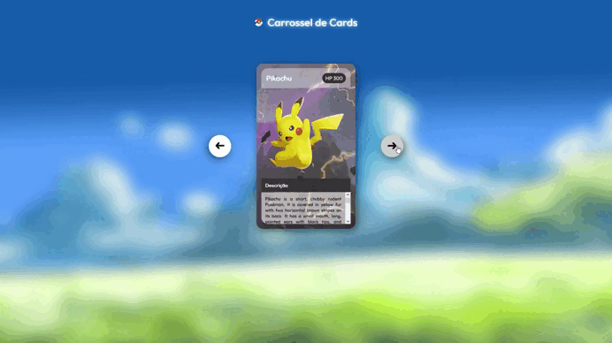

# Project - Pokemon Slider

Project made in a web event, mapa dev week.

## Table of contents

- [Overview](#overview)
    - [Screenshot](#screenshot)
    - [Links](#links)
- [My process](#my-process)
  - [Built with](#built-with)
  - [What I learned](#what-i-learned)
- [Author](#author)

## Overview

### Screenshot

### Links

- [Repository](https://github.com/jAllanOli/projeto-pokemon-slider)
- [WebPage](https://jallanoli.github.io/projeto-pokemon-slider/)

## My process

### Built with

- Semantic HTML5 markup
- CSS custom properties
- Flexbox
- Javascript

### What I learned

First contact with DOM and getting elements from the document with JS making changes in the page with the buttons.

## Author

- Frontend Mentor - [@jAllanOli](https://www.frontendmentor.io/profile/jAllanOli)
- GitHub - [@jAllanOli](https://github.com/jAllanOli)
